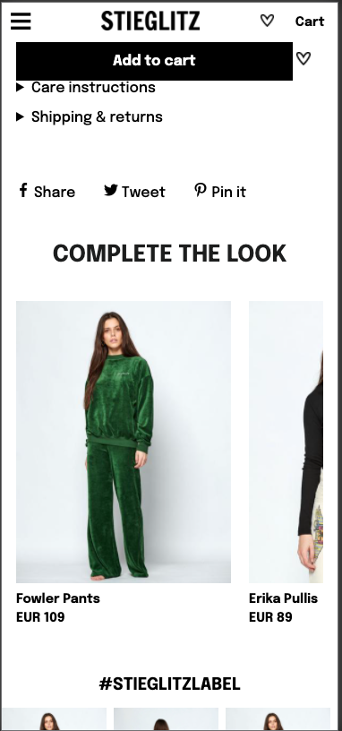

# Procesverslag
**Auteur:** Nadine Mosch

Markdown cheat cheet: [Hulp bij het schrijven van Markdown](https://github.com/adam-p/markdown-here/wiki/Markdown-Cheatsheet). Nb. de standaardstructuur en de spartaanse opmaak zijn helemaal prima. Het gaat om de inhoud van je procesverslag. Besteedt de tijd voor pracht en praal aan je website.

## Bronnenlijst
1.https://www.flaticon.com/free-icon/pinterest_2111601?term=pinterest&page=1&position=1&related_item_id=2111601
2.https://www.w3schools.com/tags/tag_select.asp
3.https://css-tricks.com/css-only-carousel/
4. https://css-tricks.com/snippets/css/complete-guide-grid/
5. https://codepen.io/nadinemosch/pen/BaLqpmP
6. https://www.youtube.com/watch?v=EoOK-YG-C1o
7. https://css-tricks.com/almanac/properties/p/position/
8. https://css-tricks.com/snippets/css/a-guide-to-flexbox/
9. https://css-tricks.com/snippets/css/complete-guide-grid/
10. https://markheath.net/post/customize-radio-button-css
11. https://en.wikipedia.org/wiki/List_of_Unicode_characters
12. https://freefrontend.com/html-details-summary-css/
13. https://codepen.io/frederickallen/pen/NZMEMw

## Eindgesprek (week 7/8)

### dit ging goed & dit was lastig

Wat er goed ging
• HTML structuur bepalen dat ging al vrij snel. Ik heb het gevoel dat ik goed begrijp hoe de HTML structuur in elkaar zit en wanneer ik bepaalde dingen in elkaar moet nesten.
• CSS selectoren snap ik voor mijn gevoel ook wel goed, ik maak amper gebruik van classes/id's > wel gebruikt in combinatie met JS
• JS lukt de basis van, zoals dingen met een onclick function / toggle

Dit was lastig
• Hamburger menu, deze is nog steeds niet hoe ik hem graag zou willen hebben (visueel vooral) maar hij werkt in ieder geval wel
• Submit knop vervangen voor een afbeelding in de footer, dit is mij niet gelukt
• Een deel van de JS staat op dit moment in de HTML wat niet de bedoeling is, maar ik begrijp niet helemaal hoe ik deze kan herschrijven zodat alles in de JS staat

**Screenshot(s):**

## Voortgang 3 (week 6)

### Stand van zaken
Ik ben verder gegaan aan de CSS voor de index pagina waarover ik een aantal specifieke vragen had + ik heb de html voor mijn detailpagina afgemaakt

**Screenshot(s):**

### Agenda voor meeting

specifieke vragen mbt opmaak van de pagina

### Verslag van meeting
Alle vragen die ik had zijn beantwoord en heb ik direct kunnen toepassen, want het waren kort vragen zoals: 

• Waarom zie ik alleen de iconen van de social media?
• Hoe kan ik het kruisje even groot maken als het hamburger menu?
• Ik wil de img's over de gehele breedte, alleen hoe select ik deze? 
• Waarom staat de tekst niet helemaal links uitgelijnd?

## Voortgang 2 (week 5)

### Stand van zaken
De HTML is in principe af voor de index pagina en ik ben begonnen aan de CSS hiervoor waarover ik een aantal specifieke vragen had

**Screenshot(s):**

### Agenda voor meeting

specifieke vragen mbt opmaak van de pagina

### Verslag van meeting
Alle vragen die ik had zijn beantwoord en heb ik direct kunnen toepassen, want het waren kort vragen zoals: 

• hoe kan ik het beste de afbeeldingen stylen?
• waarom heeft een bepaald stukje tekst niet de gehele width van het blok?
• hoe krijg ik de herospot ingezoomd waarbij alleen het middelste deel te zien is?

## Voortgang 1 (week 3)

### Stand van zaken
Opstellen van de HTML voor de index.html ging me gemakkelijk af, maar ik heb soms specifieke vragen over hoe ik het beste iets in elkaar kan nesten of welke tag ik moet gebruiken

**Screenshot(s):**

### Agenda voor meeting

specifieke vragen mbt op m'n html goed opgebouwd is + hoe ik dingen het beste in elkaar kan nesten

### Verslag van meeting
Alle vragen die ik had zijn beantwoord en heb ik direct kunnen toepassen, want het waren kort vragen zoals: 

• deze class weghalen? en dan ul div:first-of-type?
• klopt het dat ik deze buiten de ul van hierboven?
• evt img's nesten in links in de li?
• is dit juist? > stukje uit de html

## Breakdownschets (week 1)

## Intake (week 1)
-uitwerken voor de kick-off werkgroep - begin van de eerste week-

**Je startniveau:** Rode piste

**Je focus:** Extra aandacht surface laag

**Je opdracht:** https://stieglitz.nl

**Screenshot(s) van de eerste pagina (small screen):**

**Screenshot(s) van de tweede pagina (small screen):**

